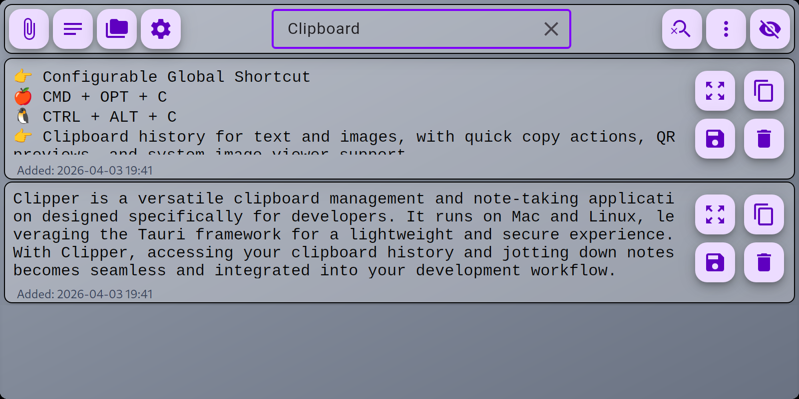
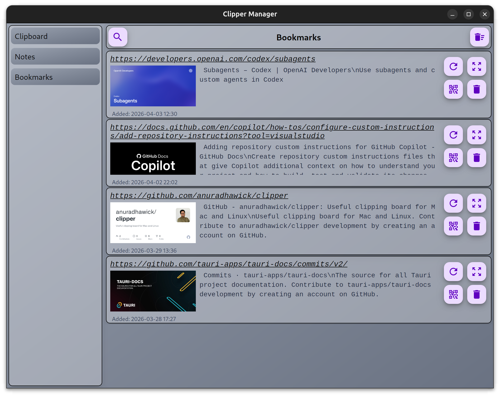
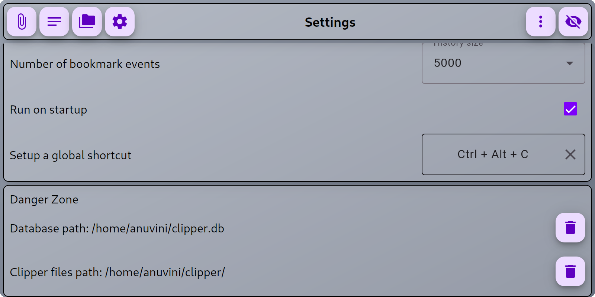

# Clipper

<p align="center">
  
</p>

Clipper is a versatile clipboard management and note-taking application designed specifically for developers. It runs on Mac and Linux, leveraging the Tauri framework for a lightweight and secure experience. With Clipper, accessing your clipboard history and jotting down notes becomes seamless and integrated into your development workflow.

## 🛑 Disclaimer 🛑

The app itself is secure, however, your clipboard might see your passwords if you manually copy them. Usually it is recommended that you autofill fields that skips clipboard involvement. No efforts have made so far to detect passwords or ignore copied passwords, yet.

## Features

<p align="center">
  
</p>

* 👉 Configurable Global Shortcut
  - 🍎 CMD + OPT + C 
  - 🐧 CTRL + ALT + C
* 👉 Clipboard history for text and images, with quick copy actions, QR previews, and system image viewer support
* 👉 Virtual scrolling for smoother browsing through large clipboard, bookmark, and note collections
* 👉 Fullscreen expansion views for clipboard items, bookmarks, and notes
* 👉 Regex-based clipboard filters with settings controls to ignore matching clipboard entries
* 👉 Configurable clipboard and bookmark history size limits
* 👉 Automatic bookmark tracking for copied links, with refresh, delete, and QR actions
* 👉 Quick text notes in both widget and manager views, including note creation from the manager
* 👉 File and Folder drop area
* 👉 Start on system startup option
* 👉 Right click menus for quick actions
* 👉 Multi monitor support

<p align="center">
  
</p>

## Installation Instructions

### Prerequisites

Before you install Clipper, ensure you have the following:

- PNPM (9.5+) from [https://pnpm.io/](https://pnpm.io/)
- Node.js (LTS version 22+) [https://nodejs.org/en](https://nodejs.org/en)
- Rust (rustc 1.93.1 (01f6ddf75 2026-02-11)) [https://www.rust-lang.org/](https://www.rust-lang.org/)
- Tauri CLI from [https://tauri.app/](https://tauri.app/)

You can install Tauri CLI by running:

```bash
cargo install tauri-cli
```

### Cloning the Repository

To get started with Clipper, clone the repository to your local machine:

```bash
git clone https://github.com/anuradhawick/clipper.git
cd clipper
```

### Running the Application

To run Clipper locally, use:

```bash
pnpm install
pnpm tauri dev
```

### Building the Application

To build a production version of Clipper, execute:

```bash
pnpm tauri build
```

## Database Migrations

Clipper now uses SQLx migrations for database schema changes.

See [MIGRATIONS.md](./MIGRATIONS.md) for:

* creating migrations
* running migrations manually
* conventions for safe schema updates

## Backend Architecture

See [ARCHITECTURE.md](./ARCHITECTURE.md) for the Tauri backend component map,
command surface, emitted frontend events, and internal backend message bus.

## Troubleshooting

Compiling in Mac is very easy and can be tricky on Linux. Please follow the guidelines here.

* [https://v2.tauri.app/start/prerequisites/](https://v2.tauri.app/start/prerequisites/)
* [https://v2.tauri.app/distribute/](https://v2.tauri.app/distribute/)

If you run into local database issues during development, you can reset the app DB by deleting `clipper.db` from your home folder and restarting the app. This clears local Clipper data.

<p align="center" >
  
</p>

## Contact

For all the great ideas: mark an issue or [hello@anuradhawick.com](mailto:hello@anuradhawick.com)
