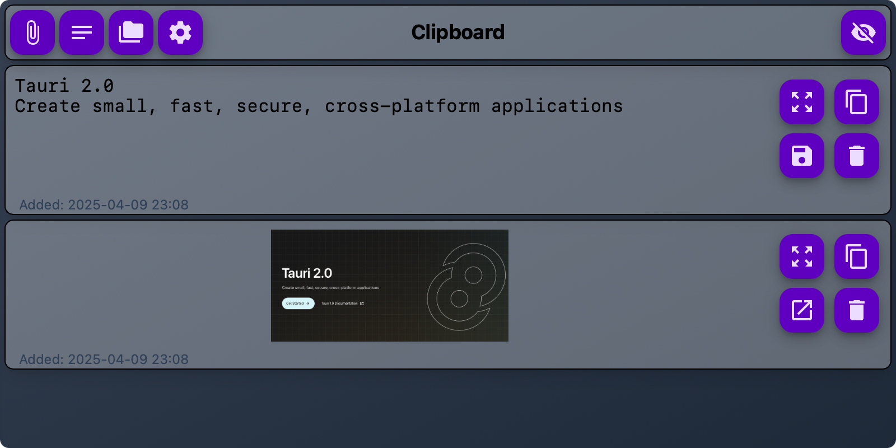
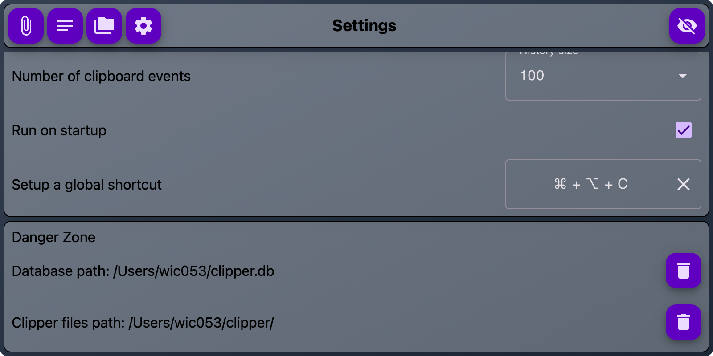

# Clipper

<p align="center">
  
</p>

Clipper is a versatile clipboard management and note-taking application designed specifically for developers. It runs on Mac and Linux, leveraging the Tauri framework for a lightweight and secure experience. With Clipper, accessing your clipboard history and jotting down notes becomes seamless and integrated into your development workflow.

## 🛑 Disclaimer 🛑

The app itself is secure, however, your clipboard might see your passwords if you manually copy them. Usually it is recommended that you autofill fields that skips clipboard involvement. No efforts have made so far to detect passwords or ignore copied passwords, yet.

## Features

<p align="center">
  
</p>

* 👉 Global Shortcut 🍎 CMD + OPT + C and 🐧 CTRL + ALT + C
* 👉 Support images in the clipboard view and copying
* 👉 Open images in system image viewer
* 👉 Maintain quick text notes in notes manager
* 👉 Multi monitor support
* 👉 URL detection
* 👉 File and Folder drop area

## Installation Instructions

### Prerequisites

Before you install Clipper, ensure you have the following:

- PNPM (9+) from [https://pnpm.io/](https://pnpm.io/)
- Node.js (LTS version 22+) [https://nodejs.org/en](https://nodejs.org/en)
- Rust (rustc 1.82.0 (f6e511eec 2024-10-15)) [https://www.rust-lang.org/](https://www.rust-lang.org/)
- Tauri CLI from [https://tauri.app/](https://tauri.app/)

You can install Tauri CLI by running:

```bash
cargo install tauri-cli
```

### Cloning the Repository

To get started with Clipper, clone the repository to your local machine:

```bash
git clone https://github.com/anuradhawick/clipper.git
cd clipper
```

### Running the Application

To run Clipper locally, use:

```bash
pnpm install
pnpm tauri dev
```

### Building the Application

To build a production version of Clipper, execute:

```bash
pnpm tauri build
```

## Troubleshooting

Compiling in Mac is very easy and can be tricky on Linux. Please follow the guidelines here.

* [https://v2.tauri.app/start/prerequisites/](https://v2.tauri.app/start/prerequisites/)
* [https://v2.tauri.app/distribute/](https://v2.tauri.app/distribute/)

In rare cases, updates could change database schema needing to reset the database. While I implement migrations for future releases, please delete db file using the settings view. You will loose all you clipboard entries from Clipper.

<p align="center" >
  
</p>

## Contact

For all the great ideas: mark an issue or [hello@anuradhawick.com](mailto:hello@anuradhawick.com)
